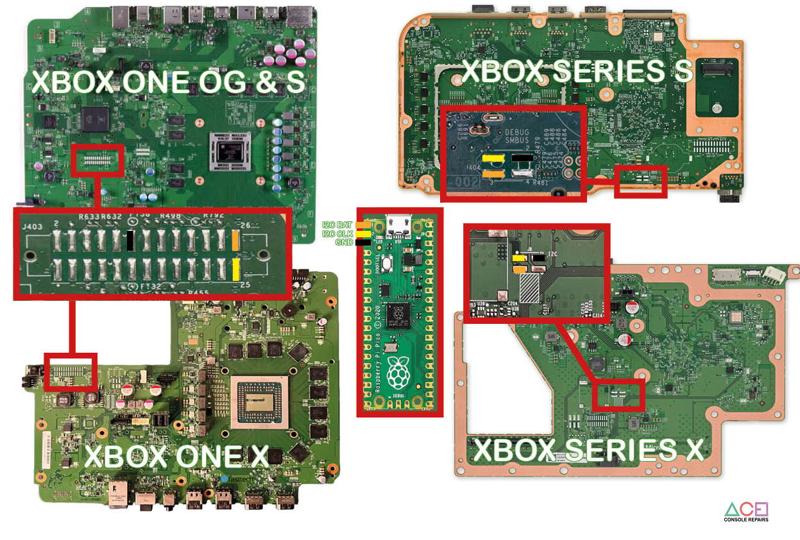
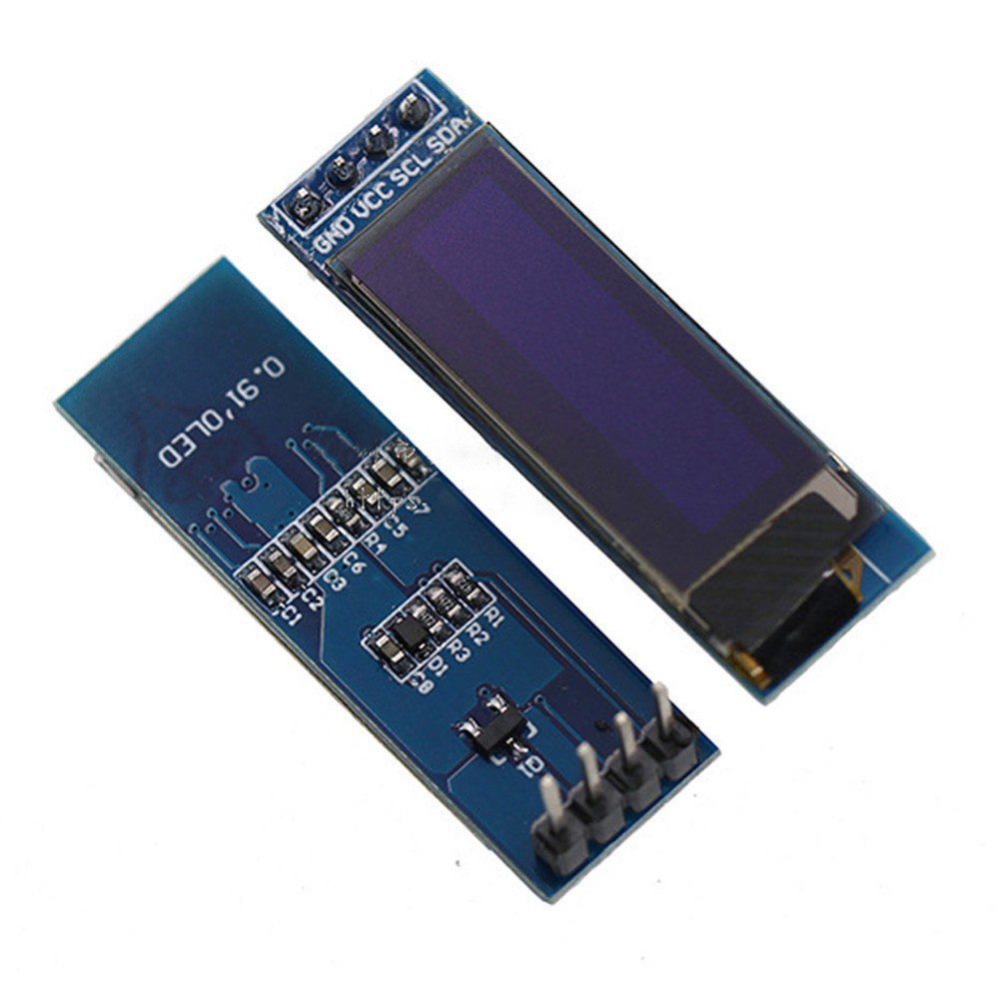
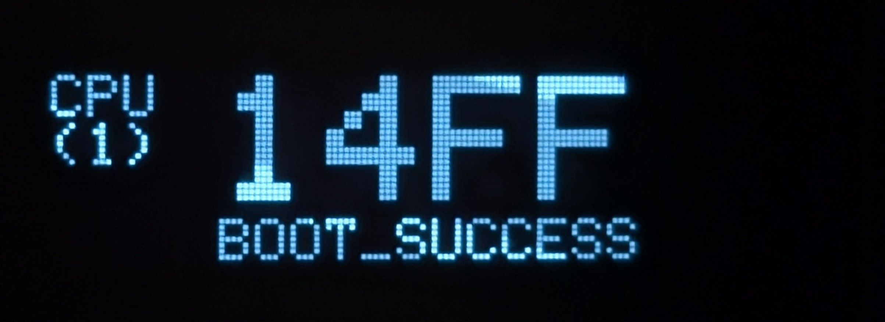
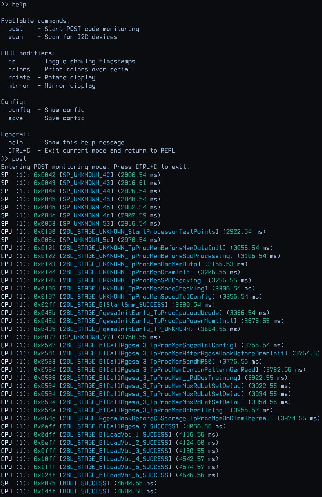

# Durango POST-Code reader via RasPi Pico

This software flashed to the Raspberry Pi Pico allows for monitoring of POST codes, which is useful for fault diagnosis on the hardware.

Jump to [Usage](#usage)

Technical infos:

- [POST bus on Xbox One - Wiki page](https://xboxoneresearch.github.io/wiki/hardware/post/)

- [List of error codes](https://errors.xboxresearch.com)

Also check out the videos from [@craftbenmine](https://github.com/craftbenmine)

and [@ACE Console Repairs](https://github.com/ACE-AU)

## Supported consoles

Via FACET connector

- ✅ Xbox One PHAT
- ✅ Xbox One S
- ✅ Xbox One X

Via AARDVARK connector

- ✅ Xbox Series S
- ✅ Xbox Series X

## Connections

> [!CAUTION]
> LOOK AT THE PIN MARKINGS ON THE FACET HEADER before soldering!
>
> Pin 1 is marked with a white dot, pins 2, 25, 26 by numbers!
>
> FACET connector orientation DOES CHANGE between console revisions!

> [!IMPORTANT]
> For Xbox Series S / X use the AARDVARK port (shown in the diagram).
>
> The FACET port on these consoles require additional components to be populated for it to work.

Pi Pico -> FACET / AARDVARK

- SDA: Pi Pico **Pin 1** (GP0) -> FACET **Pin 26** (AARDVARK, SMBUS_DATA on Series S/X)
- SCL: Pi Pico **Pin 2** (GP1) -> FACET **Pin 25** (AARDVARK, SMBUS_CLK on Series S/X)
- GND -> GND

Thx to [@ACE-AU](https://github.com/ACE-AU) for the new diagram

### Optional: 0.91" OLED Display (SSD1306)

Used dimensions: 0.91" 128x32 pixels, monochrome

- Pi Pico 3V3 -> Display VCC
- SDA: Pi Pico **Pin  9** (GP6) -> Display **Pin SDA**
- SCL: Pi Pico **Pin 10** (GP7) -> Display **Pin SCL**
- GND -> GND

## Usage

- Download [latest release](https://github.com/xboxoneresearch/PicoDurangoPOST/releases/latest)
- Flash/Copy *.uf2 onto Pi Pico
- Listen on the exposed USB Serial interface (via PuTTy or similar UART monitor software)

How to interact ?

- On Startup, it directly goes into POST monitoring mode.
- If you hit "CTRL+C" you will be brought into the REPL-menu.
- Here you can set various options or scan for I2C devices on the bus.
- Check out the "help" command.

## Develop

- VS Code
- Extension: PlatformIO
- Upload and Monitor
