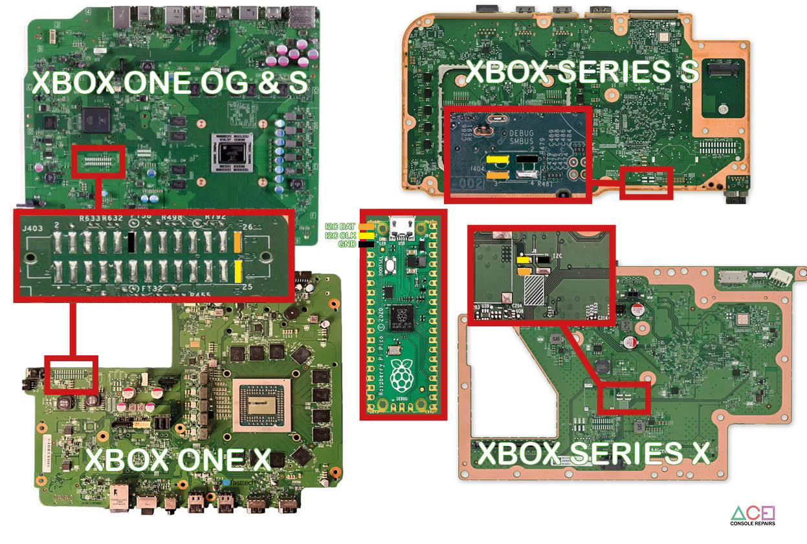
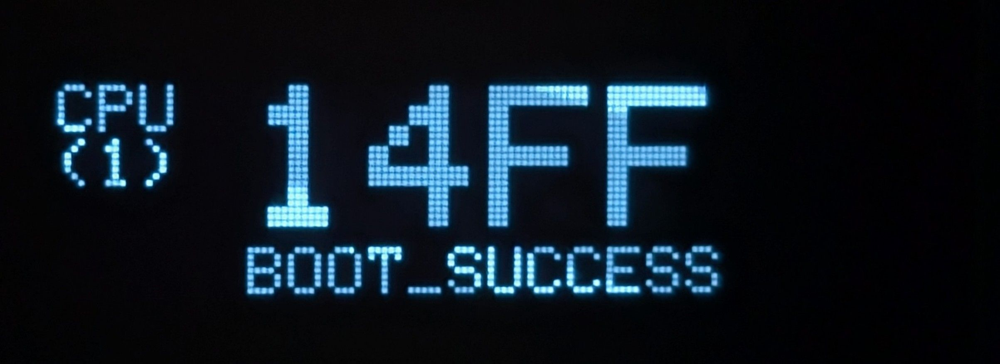
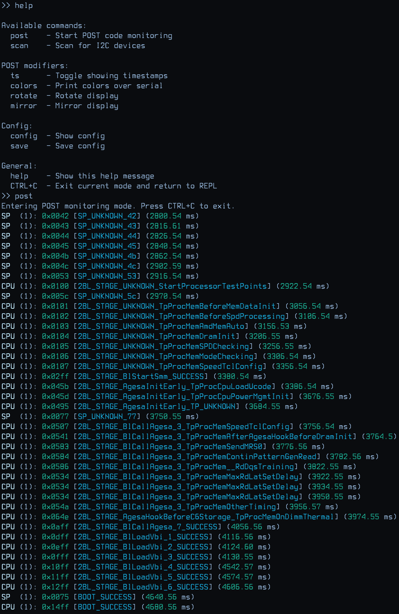

[](https://github.com/xboxoneresearch/PicoDurangoPOST/actions/workflows/build.yml)

[](https://github.com/xboxoneresearch/PicoDurangoPOST/releases/latest)

# Durango POST-Code reader via RasPi Pico

This software flashed to the Raspberry Pi Pico allows for monitoring of POST codes, which is useful for fault diagnosis on the hardware.

- [Durango POST-Code reader via RasPi Pico](#durango-post-code-reader-via-raspi-pico)
  - [Supported consoles](#supported-consoles)
  - [Technical infos:](#technical-infos)
  - [Usage](#usage)
    - [How to interact ?](#how-to-interact-)
  - [Videos / Tutorials](#videos--tutorials)
  - [Connection diagram](#connection-diagram)
    - [Optional: 0.91" OLED Display (SSD1306)](#optional-091-oled-display-ssd1306)
  - [Screenshots](#screenshots)
  - [Develop](#develop)
    - [VS Code](#vs-code)
    - [Zed Editor](#zed-editor)

## Supported consoles

Via FACET connector

- ✅ Xbox One PHAT
- ✅ Xbox One S
- ✅ Xbox One X

Via AARDVARK connector

- ✅ Xbox Series S
- ✅ Xbox Series X

## Technical infos:

- [POST bus on Xbox One - Wiki page](https://xboxoneresearch.github.io/wiki/hardware/post/)

- [List of error codes](https://errors.xboxresearch.com)

## Usage

> [!NOTE]  
> Starting with firmware v0.3.0, some obsolete functionality was removed in favor of [XboxPostcodeMonitor](https://github.com/xboxoneresearch/XboxPostcodeMonitor).
> 
> See <https://github.com/xboxoneresearch/PicoDurangoPOST/pull/11> for details.

- Download [latest release](https://github.com/xboxoneresearch/PicoDurangoPOST/releases/latest)
- Flash the firmware onto the Pi Pico (Pi Pico: `durango_post_monitor.uf2`, Pi Pico **2**: `*_pico2.uf2`)
  - Disconnect Pi Pico from your PC
  - Hold the BOOTSEL button
  - Plug in Pi Pico to the PC again
  - Release the BOOTSEL button
  - A removable storage device should appear in your file explorer
  - Drag the extracted *.uf2 file onto the *Removable storage medium*
  - The removable storage should automatically disappear
  - You are ready to go!

> [!NOTE]
> ESP32 and Teensy 4 boards are also supported, see [pin mapping](#connection-diagram) below.
>
> ESP32 / ESP32-S3 (no drag-and-drop UF2 flow, flash over serial instead):
> - From source: `pio run -e esp32 -t upload` (or `-e esp32s3` for ESP32-S3)
> - From a release: flash `durango_post_monitor_esp32.bin` / `durango_post_monitor_esp32s3.bin` with `esptool.py write_flash 0x0 <file>.bin`
>
> Teensy 4.0 / 4.1:
> - From source: `pio run -e teensy40 -t upload` (or `-e teensy41`)
> - From a release: flash `durango_post_monitor_teensy40.hex` / `durango_post_monitor_teensy41.hex` with [Teensy Loader](https://www.pjrc.com/teensy/loader.html) or `teensy_loader_cli`
> - Experimental: Teensyduino's built-in `Wire` slave mode has known reliability quirks on Teensy 4 in community reports. Test on real hardware before relying on it; the [teensy4_i2c](https://github.com/Richard-Gemmell/teensy4_i2c) library is the documented fallback if POST codes get dropped or garbled.

- Listen on the exposed USB Serial interface, Baudrate: **115200** via Serial monitor software
  - [XboxPostcodeMonitor](https://github.com/xboxoneresearch/XboxPostcodeMonitor) is recommended
    - Has errorcode auto-updating from <https://errors.xboxresearch.com>
    - Multi-console compatibility
  - PuTTY or any other generic serial monitor software
    - PuTTy: Check this [Link](https://www.ssh.com/academy/ssh/putty/windows)
    - Tip: Make use of **Saving a session configuration**, no need to re-type Serial-port and baudrate each time!
    - Downside: No multi-console functionality, no errorcode updating

### How to interact ?

> [!NOTE]
> When you have no console connected or incorrectly wired, the Serial terminal won't show any output.
>
> To verify that your Pico is working, hit **CTRL+C** to enter the menu, then type **help**, press **[ENTER]**
> To resume POST monitoring, type **post** and hit **[ENTER]**.

> [!IMPORTANT]
> The console needs to be at least receiving standby power to start the Southbridge. If, due to
> a hardware fault this is not possible, the underlying issues have to be eliminated first, to be able to use
> this tool.

Check [Screenshots](#screenshots) to see how the sofware output looks.

Generally:

- On Startup, it directly goes into POST monitoring mode.
- If you hit "CTRL+C" you will be brought into the REPL-menu.
- Here you can set various options
- Check out the "help" command.

Jump to the [Connection diagram](#connection-diagram)

## Videos / Tutorials

Check out the videos from [@craftbenmine](https://github.com/craftbenmine)

[](https://www.youtube.com/watch?v=BuPhxKdxU0g)

and [@ACE Console Repairs](https://github.com/ACE-AU)

[](https://www.youtube.com/watch?v=b2gaV6t57Mc)

## Connection diagram

> [!CAUTION]
> LOOK AT THE PIN MARKINGS ON THE FACET HEADER before soldering!
>
> Pin 1 is marked with a white dot, pins 2, 25, 26 by numbers!
>
> FACET connector orientation DOES CHANGE between console revisions!

> [!IMPORTANT]
> For Xbox Series S / X use the AARDVARK port (shown in the diagram).
>
> The FACET port on these consoles require additional components to be populated for it to work.

Pi Pico -> FACET / AARDVARK

- SDA: Pi Pico **Pin 1** (GP0) -> FACET **Pin 26** (AARDVARK **Pin 3** on Series S/X)
- SCL: Pi Pico **Pin 2** (GP1) -> FACET **Pin 25** (AARDVARK **Pin 1** on Series S/X)
- GND -> GND



Thx to [@ACE-AU](https://github.com/ACE-AU) for the new diagram

ESP32 (env `esp32`) -> FACET / AARDVARK

- SDA: ESP32 **GPIO21** -> FACET **Pin 26** (AARDVARK **Pin 3** on Series S/X)
- SCL: ESP32 **GPIO22** -> FACET **Pin 25** (AARDVARK **Pin 1** on Series S/X)
- GND -> GND

ESP32-S3 (env `esp32s3`) -> FACET / AARDVARK

- SDA: ESP32-S3 **GPIO8** -> FACET **Pin 26** (AARDVARK **Pin 3** on Series S/X)
- SCL: ESP32-S3 **GPIO9** -> FACET **Pin 25** (AARDVARK **Pin 1** on Series S/X)
- GND -> GND

Teensy 4.0 / 4.1 (envs `teensy40` / `teensy41`) -> FACET / AARDVARK

- SDA: Teensy **Pin 18** (Wire, fixed in hardware) -> FACET **Pin 26** (AARDVARK **Pin 3** on Series S/X)
- SCL: Teensy **Pin 19** (Wire, fixed in hardware) -> FACET **Pin 25** (AARDVARK **Pin 1** on Series S/X)
- GND -> GND

### Optional: 0.91" OLED Display (SSD1306)

Model: SSD1306 0.91" 128x32 pixels, monochrome

[SSD 1306 module photo](./assets/ssd1306_module.jpg)

Pi Pico:

- Pi Pico 3V3 -> Display VCC
- SDA: Pi Pico **Pin  9** (GP6) -> Display **Pin SDA**
- SCL: Pi Pico **Pin 10** (GP7) -> Display **Pin SCL**
- GND -> GND

ESP32:

- ESP32 3V3 -> Display VCC
- SDA: ESP32 **GPIO18** -> Display **Pin SDA**
- SCL: ESP32 **GPIO19** -> Display **Pin SCL**
- GND -> GND

ESP32-S3:

- ESP32-S3 3V3 -> Display VCC
- SDA: ESP32-S3 **GPIO4** -> Display **Pin SDA**
- SCL: ESP32-S3 **GPIO5** -> Display **Pin SCL**
- GND -> GND

Teensy 4.0 / 4.1:

- Teensy 3V3 -> Display VCC
- SDA: Teensy **Pin 17** (Wire1, fixed in hardware) -> Display **Pin SDA**
- SCL: Teensy **Pin 16** (Wire1, fixed in hardware) -> Display **Pin SCL**
- GND -> GND



NOTE: This image is showing firmware v0.2.3 - starting with v0.3.0 POST code names are not shown on display anymore, see note in [Usage](#usage).

## Screenshots

This is showing the output of firmware v0.2.0.



NOTE: This screenshot is showing firmware v0.2.3 - starting with v0.3.0 POST code names are not shown via serial anymore, see note in [Usage](#usage).

## Develop

### VS Code

- Use **VS Code** as your IDE / Code Editor
- Install the extension [**PlatformIO**](https://platformio.org/)
- Edit the code
- Change to the **PlatformIO**-tab in VS Code and choose **Upload and Monitor** to compile and upload the code

### Zed Editor

- Use **Zed** as your IDE / Code Editor
- Install [**PlatformIO Core (CLI)**](https://docs.platformio.org/en/latest/core/installation/index.html)
- Generate a compilation database so `clangd` can resolve includes: `pio run -e pico -t compiledb`
- Add a `.zed/settings.json` pointing `clangd` at the ARM toolchain so it picks up the cross-compiler's built-in headers:
  ```json
  {
    "lsp": {
      "clangd": {
        "binary": {
          "arguments": [
            "--query-driver=<path-to-.platformio>/packages/toolchain-rp2040-earlephilhower/bin/*"
          ]
        }
      }
    }
  }
  ```
- Edit the code
- Compile and upload with `pio run -e pico -t upload`, monitor with `pio device monitor -b 115200`
- Re-run the `compiledb` command whenever `platformio.ini` deps/envs change, since the database goes stale otherwise
